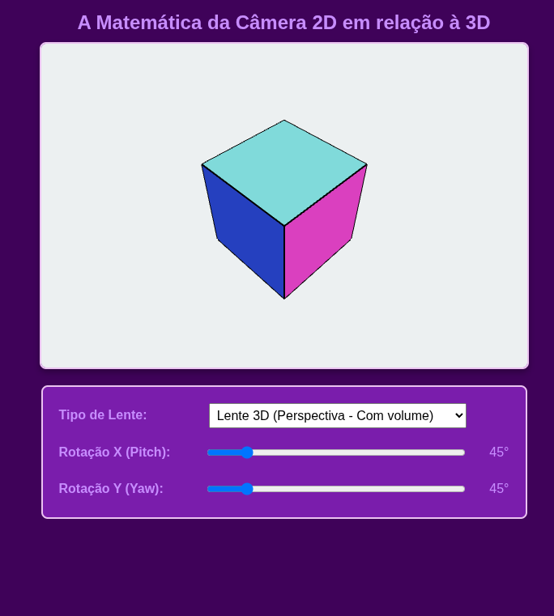

# Oficina: Desenvolvimento de Jogos 3D com Panda3D e Python

**Duração:** 3 horas
**Abordagem:** Teórico-Prática
**Objetivo:** Apresentar os conceitos fundamentais do desenvolvimento de jogos 3D, as etapas do processo criativo e técnico, e introduzir os alunos à prática de programação 3D utilizando a engine Panda3D com a linguagem Python.

Esta versão expandida do material incorpora os fundamentos matemáticos e algorítmicos essenciais para o desenvolvimento de jogos, utilizando as referências bibliográficas fornecidas para aprofundar a teoria. O texto agora detalha a física da movimentação, a lógica de interação em ambientes tridimensionais e mecanismos clássicos de jogabilidade.

---

# Parte 1: Conceitos Chave e Teoria

Nesta seção, exploraremos os pilares fundamentais que sustentam o desenvolvimento de jogos modernos. Iniciaremos com a definição técnica e lúdica de jogo, avançando para a fundamentação matemática que permite a transição do plano 2D para o volume 3D. Além disso, detalharemos as etapas do ciclo de vida de um projeto e o papel central dos motores de jogo, finalizando com uma análise técnica sobre movimentação, interação e algoritmos clássicos de comportamento e visibilidade que definem a experiência do jogador.

### 1.1 O que é um Jogo Eletrônico?

Um **jogo eletrônico** é uma atividade lúdica e interativa, limitada por regras e por um universo diegético (interno ao jogo), processada por sistemas digitais [2]. Segundo Marques, o jogo não deve ser visto apenas como um software, mas como um sistema dinâmico onde a riqueza do contexto e a jornada de agência do jogador determinam o sucesso da experiência, transcendendo a simples condição de vitória [2].

### 1.2 Jogos 2D X Jogos 3D: A Matemática do Espaço

A distinção entre **jogos 2D e 3D** reside primordialmente na álgebra linear aplicada. Enquanto o 2D trabalha com vetores de duas componentes $(x, y)$, o 3D introduz o eixo $z$, exigindo transformações matriciais para projetar coordenadas tridimensionais em uma tela bidimensional [1, 5].

#### 1.2.1 O Espaço de Coordenadas (X, Y e Z)

O primeiro simulador, cuja interface pode ser vista na Figura 1, demonstra como a transição de um quadrado (2D) para um cubo (3D) depende da manipulação do eixo $Z$. No modo 3D, a adição desta dimensão permite que o objeto deixe de ser apenas uma silhueta plana para se tornar um volume que ocupa o espaço, permitindo translações em profundidade.

*Figura 01: Demonstração da transição entre plano (2D) e volume (3D) via eixos cartesianos.*


Para acessar o **Simulador Interativo**, acesse este *link*: [Acesse o Explorador de Coordenadas](https://www.google.com/search?q=./2d3d-visualizacao-1.html). Procure interagir com os dois tipos de objetos, planares e volumétricos, para compreender melhor seus comportamentos.

#### 1.2.2 A Matemática da Câmera e Projeção

O segundo simulador foca na visualização. Um objeto 3D pode parecer "achatado" dependendo da lente utilizada. A **Lente Perspectiva** simula o olho humano, onde as linhas convergem para um ponto de fuga, criando profundidade. Já a **Lente Ortográfica** (comum em visões técnicas e jogos 2D) mantém as linhas paralelas, eliminando a distorção de distância.

*Figura 02: Comparativo entre Projeção Perspectiva (3D Real) e Ortográfica (2D/Técnica).*


Para acessar o **Simulador Interativo** que permite ver e interagir com as abordagens de *Lente Perspectiva* e *Lente Ortográfica*, utilize este *link*:  [Acesse o Visualizador de Projeção](https://www.google.com/search?q=./2d3d-visualizacao-2.html). Interaja para entender melhor os conceitos abordados.

#### 1.2.3 Comparativo das abordagens 2D e 3D

**Quadro 01:** Comparativo rápido entre Jogos 2D e 3D

| Característica | Jogos 2D | Jogos 3D |
| --- | --- | --- |
| **Coordenadas** | Baseadas nos eixos $X$ e $Y$ [5]. | Adição do eixo $Z$ (profundidade) [1]. |
| **Visualização** | Perspectiva fixa ou paralela (*scrolling*). | Câmera dinâmica com rotação e *zoom* [2]. |
| **Representação** | Geralmente baseada em *sprites* ou pixels. | Baseada em malhas poligonais e vértices [1]. |
| **Complexidade** | Lógica de colisão e renderização simplificada. | Cálculos intensivos de iluminação e projeção [5]. |
| **Interação** | Movimentação linear e previsível. | Exploração espacial e liberdade de perspectiva. |

*Fonte: Adaptado de Pontes [5] e Rodrigues & Silva [1].*

### 1.3 As Etapas do Desenvolvimento e o Ciclo de Produção

O desenvolvimento é um processo iterativo dividido em três grandes blocos [1, 4]:

1. **Pré-Produção:** Focada no **Brainstorming** e na criação do **GDD (Game Design Document)**, que atua como a documentação técnica e conceitual de referência para toda a equipe [4].
2. **Produção:** Onde ocorre a **Modelagem 3D** (criação de malhas), a **Texturização** (mapeamento de cores e materiais) e o **Level Design** (arquitetura e iluminação do cenário).
3. **Pós-Produção:** Ajustes, correção de bugs e polimento da experiência.

### 1.4 O Papel do Motor de Jogo (Game Engine) e os Ambientes de Criação de Jogos *No-Code* ou *Low-Code*

A *Engine* é o coração técnico do jogo, gerenciando o **Grafo de Cena** — uma estrutura hierárquica de nós onde cada objeto (personagem, luz, chão) está posicionado [1]. Motores modernos utilizam a arquitetura de **Entidade-Componente**, permitindo que objetos recebam funcionalidades modulares, como física ou scripts de IA, sem a necessidade de heranças complexas de código [3].

Exemplos de Motores de Jogos são a Unity, UnReal e o [Panda3D](https://docs.panda3d.org/1.10/python/index) (que usaremos neste material).

Também existem ambientes de desenvolvimento completos e que exigem pouco ou nenhum código *script* para o desenvolvimento de um jogo eletrônico (*no-code* ou *low-code*, respectivamente). Exemplos destes ambientes são:

* [001 Game Creator](https://001gamecreator.com/?srsltid=AfmBOoqBiU33yPVOdwf4g85MPFEPNKg6vU5XiSlVBw-qoLpLmELES0Ox)
* [Flowlab](https://flowlab.io/)
* [GDevelop](https://gdevelop.io/pt-br)
* [RPG Maker](https://pt.wikipedia.org/wiki/RPG_Maker)

### 1.5 Movimentação e Interação em Ambientes 3D

Diferente do 2D, onde o movimento é frequentemente restrito a planos laterais ou vista aérea, no 3D a movimentação baseia-se em **vetores de direção** e **orientação** (usando, normalmente, [quaternions](https://www.ime.usp.br/~gorodski/teaching/quat-rot.pdf) ou [ângulos de Euler](https://www.sbg-systems.com/br/glossary/attitude-in-navigation/)).

* **Movimentação do Personagem:** O personagem interage com o cenário através de [**Kinematic Body**]() ou **Dynamic Body**. O movimento é calculado somando o vetor de entrada do jogador (exemplo, as teclas WASD de direcional) à posição atual, respeitando a gravidade e o atrito.
* **Interação com o Cenário (Chão e Paredes):** O motor de jogo utiliza **Colliders** (colisores). Para o chão, usa-se a técnica de *Raycasting* (disparo de raios) para detectar a distância exata até o solo e permitir que o personagem suba degraus ou rampas. Paredes são tratadas como barreiras físicas que impedem a penetração do vetor de movimento.
* **Interação com Objetos:** Quando um jogador "pega" um item ou abre uma porta, ocorre um evento de intersecção entre o volume de colisão do jogador (*Trigger*) e o objeto 3D.

### 1.6 Mecanismos Clássicos e Lógica de Jogo

Para criar desafios e profundidade, utilizamos algoritmos específicos de gerenciamento de mundo:

* **Fog of War (Nevoeiro de Guerra):** Sistema que limita a visão do jogador a uma área ao redor do personagem. Em 3D, isso pode ser feito via *shaders* ou grades de visibilidade que "escondem" objetos fora do raio de visão.
* **Nearest Neighbor (Auto-Mira):** Algoritmo que calcula a distância euclidiana entre o jogador e todos os inimigos ativos, selecionando aquele com o menor valor para auxiliar o combate ou focar a câmera.
* **Spawn Seguro:** Lógica que verifica se o ponto de nascimento (spawn) do personagem ou inimigo está livre de colisores ou fora do campo de visão do jogador, evitando mortes injustas (*telefrag*).
* **Steering Behaviors:** Comportamentos de direção autônoma (como perseguir, fugir ou vagar) baseados em forças vetoriais. Em vez de mover o inimigo de forma linear, ele "pilota" seu movimento suavemente em direção ao alvo [3].
* **Limites do Mundo:** Uso de volumes de contenção (*World Bounds*) que impedem que o jogador caia no vazio infinito do motor 3D, essencial para manter a integridade da cena.

### 1.3 As Etapas do Desenvolvimento de um Jogo Digital

A construção de um jogo é um processo interdisciplinar dividido em fases de Pré-Produção, Produção e Pós-Produção [1, 4]. As principais etapas incluem:

* **Brainstorming:** Definição do conceito e estilo.
* **Documento de Design de Jogo (GDD):** A "planta baixa" técnica e criativa do projeto [4].
* **Arte de Conceito (Concept Art):** Referências estéticas para a produção.
* **Modelagem Tridimensional:** Criação das malhas poligonais (escultura digital) [2].
* **Texturização:** Aplicação de superfícies 2D sobre modelos 3D para realismo (mapas de relevo) [2].
* **Design de Nível (Level Design):** Montagem do mundo, luzes e regras dentro do motor de jogo [4].

### 1.4 O Papel do Motor de Jogo (Game Engine)

Motores de jogo como o Panda3D ou Unity atuam como *frameworks* que abstraem a complexidade do hardware gráfico [1, 3]. Eles gerenciam a renderização, física e detecção de colisão. No Panda3D, essa organização é feita via **Grafo de Cena** (*Scene Graph*), onde cada elemento é um nó em uma hierarquia que define o que será processado pela câmera.

> **Nota sobre Componentização**
> A maioria dos motores modernos utiliza "Objetos de Jogo" (*GameObjects*) que recebem "Componentes" para definir seu comportamento (como scripts de movimento ou física), facilitando a prototipagem rápida [3].


Esta segunda parte do material foca na transição da teoria para a implementação técnica. Vamos evoluir um código básico do Panda3D, camada por camada, integrando os conceitos de matemática e lógica de jogos discutidos anteriormente.

## Parte 2: O Processo Prático no Panda3D

O Panda3D é uma *game engine* robusta, controlada via Python, que gerencia o ciclo de vida de um jogo. Seu conceito central é o **Grafo de Cena** (*Scene Graph*), uma árvore hierárquica onde o nó raiz é o `render`. Qualquer objeto para ser visível deve ser "filho" deste nó.

Usaremos a Panda3D para implmentar o **Arena de Fuga**. Trata-se de um protótipo dinâmico de **sobrevivência** e **evasão** projetado para demonstrar a aplicação prática da matemática em ambientes tridimensionais.

O objetivo principal do jogador é manter-se vivo pelo maior tempo possível, movimentando-se estrategicamente para fugir de três "clones" avermelhados que nascem em pontos seguros do mapa e o perseguem implacavelmente (utilizando a lógica de Steering). 

Para jogar, o usuário deve utilizar as clássicas teclas direcionais W, A, S e D para navegar pela arena, tendo o cuidado de não ser encurralado contra os limites invisíveis do cenário. 

Durante a fuga, o sistema rotaciona automaticamente o personagem principal para que ele sempre encare a ameaça mais próxima (Auto-mira), ilustrando como os algoritmos de cálculo de distância afetam a jogabilidade e a percepção de espaço em tempo real.

Esta reestruturação foca na construção lógica do projeto, partindo da ambientação técnica para a interatividade e, finalmente, para a lógica de estado do jogo (vitória e derrota). Essa progressão é ideal para uma oficina, pois permite que os alunos vejam o "mundo" surgir antes de darem vida a ele.

### 2.1 Evolução 1: Cenário, Atores e Limites de Mundo

Nesta etapa inicial, focamos no **Design de Nível** e na **Modelagem**. Carregamos o ambiente e o personagem, definindo as coordenadas iniciais e as constantes que representam os limites do nosso mundo. Sem movimento ainda, o objetivo é garantir que todos os elementos ocupem o espaço tridimensional corretamente.

```python
from direct.showbase.ShowBase import ShowBase
from panda3d.core import Vec3

class Fase1(ShowBase):
    def __init__(self):
        ShowBase.__init__(self)
        
        # 1. Criação do Espaço Virtual e Atores
        self.jogador = self.loader.loadModel("models/panda-model")
        self.jogador.reparentTo(self.render)
        self.jogador.setScale(0.005)
        self.jogador.setPos(0, 0, 0) # Posição central inicial

        # 2. Definição dos Limites de Mundo
        # Usamos constantes para definir as bordas da "arena"
        self.LIMITE_X = 20
        self.LIMITE_Y = 20
        
        # Posicionamento da câmera para visão geral da arena
        self.cam.setPos(0, -50, 30)
        self.cam.lookAt(0, 0, 0)

# Para testar, basta rodar: Fase1().run()

```

### 2.2 Evolução 2: Implementando a Movimentação WASD

Com o cenário montado, introduzimos o **Vetor de Entrada**. Em vez de teletransportar o personagem, utilizamos um `keyMap` dentro do **Game Loop** para calcular o deslocamento a cada frame, garantindo que o personagem respeite os limites definidos na etapa anterior.

```python
# ... (adicionado à classe da Evolução 1)
        self.keyMap = {"w": False, "s": False, "a": False, "d": False}
        self.accept("w", self.setKey, ["w", True])
        self.accept("w-up", self.setKey, ["w", False])
        # (repetir para as teclas S, A e D)

        self.taskMgr.add(self.controle_movimento, "ControleMovimento")

    def setKey(self, key, val): self.keyMap[key] = val

    def controle_movimento(self, task):
        dt = globalClock.getDt()
        pos = self.jogador.getPos()
        vel = 15.0 * dt

        if self.keyMap["w"]: pos.y += vel
        if self.keyMap["s"]: pos.y -= vel
        if self.keyMap["a"]: pos.x -= vel
        if self.keyMap["d"]: pos.x += vel

        # Aplicação Algébrica dos Limites de Mundo [4]
        pos.x = max(min(pos.x, self.LIMITE_X), -self.LIMITE_X)
        pos.y = max(min(pos.y, self.LIMITE_Y), -self.LIMITE_Y)
        
        self.jogador.setPos(pos)
        return task.cont

```

### 2.3 Evolução 3: IA, Interação e Condições de Jogo

O estágio final transforma o ambiente em um jogo real. Implementamos o **Spawn Seguro**, o **Steering (Perseguição)** e a **Auto-mira**. Aqui, introduzimos a lógica de **Vitória** (sobreviver por um tempo determinado) e **Derrota** (contato físico com o inimigo).

```python
# Adicionando lógica de vitória/derrota no Game Loop
def game_loop(self, task):
    if self.estado_jogo != "JOGANDO": return task.cont
    
    dt = globalClock.getDt()
    self.timer_sobrevivencia += dt

    # Condição de Vitória: Sobreviver 30 segundos
    if self.timer_sobrevivencia >= 30:
        print("VITÓRIA! Você sobreviveu à arena.")
        self.estado_jogo = "VITORIA"

    for inimigo in self.inimigos:
        # Cálculo de Distância para Colisão e IA
        dist = (inimigo.getPos() - self.jogador.getPos()).length()
        
        # Condição de Perda: Inimigo alcançou o jogador
        if dist < 1.5:
            print("GAME OVER! O inimigo te pegou.")
            self.estado_jogo = "DERROTA"
            
        # IA: Steering Pursuit
        direcao = self.jogador.getPos() - inimigo.getPos()
        direcao.normalize()
        inimigo.setPos(inimigo.getPos() + direcao * 4.0 * dt)
    
    return task.cont

```

---

### Código Final Integrado

Abaixo está o código completo que unifica todos os conceitos discutidos. Este arquivo é o material principal que os alunos devem ter ao final da oficina para estudo posterior.

```python
from direct.showbase.ShowBase import ShowBase
from panda3d.core import Vec3, loadPrcFileData
from direct.gui.OnscreenText import OnscreenText
import random, sys

loadPrcFileData('', 'window-title Arena de Sobrevivencia 3D')

class JogoCompleto(ShowBase):
    def __init__(self):
        ShowBase.__init__(self)
        
        # Estado Inicial
        self.estado_jogo = "JOGANDO"
        self.timer_sobrevivencia = 0
        self.LIMITE = 20
        
        # Interface Simples
        self.texto_hud = OnscreenText(text="Sobreviva: 0s", pos=(-1.2, 0.9), scale=0.07, fg=(1,1,1,1))

        # 1. Espaço e Atores (Evolução 1)
        self.jogador = self.loader.loadModel("models/panda-model")
        self.jogador.reparentTo(self.render)
        self.jogador.setScale(0.005)
        
        self.cam.setPos(0, -60, 40)
        self.cam.lookAt(0, 0, 0)

        # 2. Inimigos e Spawn Seguro (Evolução 3)
        self.inimigos = []
        for i in range(3):
            inimigo = self.loader.loadModel("models/panda-model")
            inimigo.reparentTo(self.render)
            inimigo.setColor(1, 0.2, 0.2, 1)
            inimigo.setScale(0.003)
            self.inimigos.append(inimigo)
            self.spawn_seguro(inimigo)

        # 3. Controles WASD (Evolução 2)
        self.keyMap = {"w":False, "s":False, "a":False, "d":False}
        for k in ["w", "s", "a", "d"]:
            self.accept(k, self.setKey, [k, True])
            self.accept(k+"-up", self.setKey, [k, False])
        self.accept("escape", sys.exit)

        self.taskMgr.add(self.game_loop, "GameLoop")

    def setKey(self, key, val): self.keyMap[key] = val

    def spawn_seguro(self, obj):
        while True:
            pos = Vec3(random.uniform(-18, 18), random.uniform(-18, 18), 0)
            if (pos - self.jogador.getPos()).length() > 15:
                obj.setPos(pos)
                break

    def game_loop(self, task):
        if self.estado_jogo != "JOGANDO": return task.cont
        
        dt = globalClock.getDt()
        self.timer_sobrevivencia += dt
        self.texto_hud.setText(f"Sobreviva: {int(self.timer_sobrevivencia)}s / 30s")

        # Movimentação e Limites
        p = self.jogador.getPos()
        v = 15 * dt
        if self.keyMap["w"]: p.y += v
        if self.keyMap["s"]: p.y -= v
        if self.keyMap["a"]: p.x -= v
        if self.keyMap["d"]: p.x += v
        p.x = max(min(p.x, self.LIMITE), -self.LIMITE)
        p.y = max(min(p.y, self.LIMITE), -self.LIMITE)
        self.jogador.setPos(p)

        # Vitória
        if self.timer_sobrevivencia >= 30:
            self.texto_hud.setText("VITORIA! Voce sobreviveu.")
            self.estado_jogo = "FIM"

        # IA e Colisão (Derrota)
        alvo_proximo = None
        dist_min = 999
        
        for inimigo in self.inimigos:
            d_vec = self.jogador.getPos() - inimigo.getPos()
            dist = d_vec.length()
            
            if dist < 1.2:
                self.texto_hud.setText("GAME OVER! O inimigo te pegou.")
                self.estado_jogo = "FIM"
            
            if dist < dist_min:
                dist_min = dist
                alvo_proximo = inimigo

            # Steering e LookAt
            d_vec.normalize()
            inimigo.setPos(inimigo.getPos() + d_vec * 5 * dt)
            inimigo.lookAt(self.jogador)

        # Auto-Mira (Nearest Neighbor)
        if alvo_proximo: self.jogador.lookAt(alvo_proximo)
            
        return task.cont

JogoCompleto().run()

```

### Analisando com a Teoria

* **`timer_sobrevivencia`**: Representa a progressão da jornada do jogador até a condição final [2].
* **`if dist < 1.2`**: Implementa a regra de colisão e o fim do universo lúdico do jogo conforme definido no GDD [4].
* **`self.spawn_seguro`**: Utiliza a **Distância Euclidiana** para garantir a integridade do desafio inicial, evitando mortes por falhas de sistema (*bugs* de posicionamento).
* **`max(min(...))`**: Garante que o personagem interaja com os **Limites de Mundo**, simulando paredes invisíveis fundamentais para o *Level Design*.

## 3. Desafio

Vocês têm 30 minutos para analisar o código do protótipo final ("Arena de Sobrevivência 3D") e implementar novas mecânicas que tornem o jogo mais dinâmico e interessante para o jogador.

### Nível 1: Ameaça Crescente (Ajuste de Variáveis)

No momento, os inimigos perseguem o jogador a uma velocidade constante. O desafio é fazer com que a dificuldade aumente progressivamente.

* **A Tarefa:** Altere a lógica de perseguição no `game_loop` para que a velocidade dos inimigos aumente com o passar do tempo.
* **Dica:** Vocês já possuem uma variável chamada `self.timer_sobrevivencia` que cresce a cada segundo. Como vocês podem usá-la na equação matemática da velocidade do inimigo?

### Nível 2: O Botão de Pânico / *Sprint* (Mapeamento de Teclas)

O jogador precisa de uma chance de escapar quando for encurralado!

* **A Tarefa:** Implementem uma mecânica de corrida (*Sprint*). Quando o jogador segurar a tecla **Shift** (ou a **Barra de Espaço**), a velocidade de movimentação dele deve dobrar. Ao soltar a tecla, a velocidade deve voltar ao normal.
* **Dicas:** 1. Lembrem-se de adicionar a nova tecla ao dicionário `self.keyMap`.
2. Usem o método `self.accept()` no `__init__` para registrar quando a tecla é pressionada e quando é solta (ex: `shift-up`).
3. No `game_loop`, criem um teste condicional (`if`) que altera a variável da velocidade do jogador antes das posições X e Y serem calculadas.

### Nível 3: Alerta Visual de Fronteira (Manipulação de Nós)

Em ambientes 3D, é importante dar *feedback* visual ao jogador.

* **A Tarefa:** Façam com que o modelo 3D do jogador mude para uma cor de alerta (como amarelo ou laranja) toda vez que ele estiver muito perto (ex: a menos de 2 unidades de distância) de qualquer um dos Limites de Mundo (as bordas invisíveis da arena). Se ele voltar para o centro, a cor deve voltar ao normal (branco ou cinza).
* **Dica:** Vocês precisarão verificar o valor absoluto das coordenadas `p.x` e `p.y` dentro do `game_loop` e usar o método `self.jogador.setColor(R, G, B, A)` para alterar o aspecto do modelo em tempo real.

## 4. Referências Bibliográficas

* [1] Rodrigues, L. B., & da Silva, J. C. (2010). *Framework para Desenvolvimento de Jogos 3D Baseado na API O3D*. Revista Eletrônica TECCEN, Vassouras, v. 3, n. 2.
* [2] Marques, G. C. (2015). *Introdução ao desenvolvimento de jogos digitais utilizando o motor de jogo UDK*. Dissertação de Mestrado, Pontifícia Universidade Católica de São Paulo (PUC-SP).
* [3] Passos, E. B., et al. (2009). *Tutorial: Desenvolvimento de Jogos com Unity 3D*. VIII Brazilian Symposium on Games and Digital Entertainment, Rio de Janeiro.
* [4] Angelo, G. F. (2022). *Tutorial para desenvolvimento de jogos eletrônicos 3D na Unity*. Monografia (Graduação), Universidade Federal da Paraíba (UFPB).
* [5] Pontes, R. G. (2024). *Aprendendo a programar jogos em Unity: introdução ao desenvolvimento de jogos em 3D*. GameBlast.